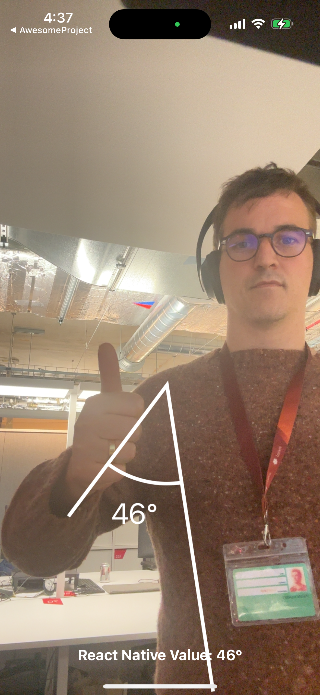

# quickpose-react-native-pose-estimation

A basic example of React Native running a fast pose estimation library.

QuickPose provides developer-oriented cutting edge AI fitness features, with easy integration and production ready code. Dramatically improving the speed of implementation for mobile applications.

This repo assumes you have downloaded the official react native demo and followed their installation instructions: [https://reactnative.dev/docs/environment-setup](https://reactnative.dev/docs/environment-setup)

For official repo and installation instructions ---> [https://github.com/quickpose/quickpose-ios-sdk
](https://github.com/quickpose/quickpose-ios-sdk)

