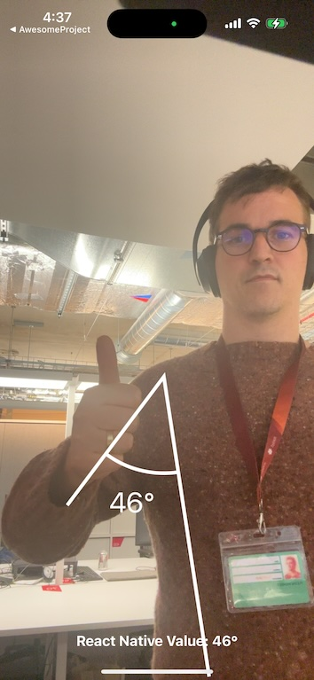

# quickpose-react-native-pose-estimation



A basic example of React Native running a fast pose estimation library on both iOS and Android.

QuickPose provides developer-oriented cutting edge AI fitness features, with easy integration and production ready code. Dramatically improving the speed of implementation for mobile applications.

This repo assumes you have followed the official React Native environment setup: [https://reactnative.dev/docs/environment-setup](https://reactnative.dev/docs/environment-setup)

## Getting Started

```bash
cd AwesomeProject
npm install
```

### iOS

```bash
cd ios
pod install
cd ..
npx react-native run-ios
```

### Android

Requires Android SDK 26+ and a physical device (camera required).

```bash
npx react-native run-android
```

## SDK Key

Register for a free SDK key at [https://dev.quickpose.ai](https://dev.quickpose.ai) and add it to:

- **iOS**: `AwesomeProject/ios/QuickPose/QuickPoseBasicView.swift`
- **Android**: `AwesomeProject/android/app/src/main/java/com/awesomeproject/quickpose/QuickPoseViewManager.kt`

## Links

- iOS SDK: [https://github.com/quickpose/quickpose-ios-sdk](https://github.com/quickpose/quickpose-ios-sdk)
- Android SDK: [https://github.com/quickpose/quickpose-android-sdk](https://github.com/quickpose/quickpose-android-sdk)
- Documentation: [https://docs.quickpose.ai](https://docs.quickpose.ai)
